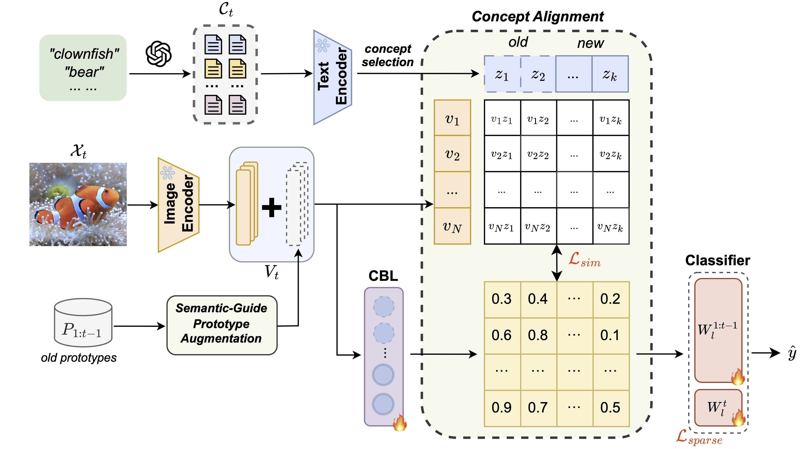

# Language Guided Concept Bottleneck Models for Interpretable Continual Learning
<a href="https://arxiv.org/abs/2503.23283"></a>
<a href="https://arxiv.org/abs/2503.23283">
    
</a>

This repo is the official PyTorch implementation of CVPR2025 paper "Language Guided Concept Bottleneck Models for Interpretable Continual Learning".

We follow the framework of [Pilot](https://github.com/sun-hailong/LAMDA-PILOT) to implement this project.



## Environment Setup

```bash
conda create -n <env name> python=3.8.10 -y
conda activate <env name>
conda install pytorch==1.13.0 torchvision==0.14.0 torchaudio==0.13.0 pytorch-cuda=11.7 -c pytorch -c nvidia --no-deps
# other dependencies
pip install -r requirements.txt
pip install git+https://github.com/openai/CLIP.git
```

## Dataset preparation
We evaluated our approch on 3 coarse-grained datasets: CIFAR-100, TinyImageNet, ImageNet100; and 4 fine-grained datasets: CUB-200, Flower102, Food101, Stanford-cars.

You should specify your data folder in `utils/data.py`:
```python
def download_data(self):
    assert 0,"You should specify the folder of your dataset"
    train_dir = '[DATA-PATH]/train/'
    test_dir = '[DATA-PATH]/val/'
```
or
```python
def download_data(self):
    assert 0,"You should specify the folder of your dataset"
    root="/[DATA_PATH]/"
    ....
```

## Concept preparation
We provide the concepts that are utilized in our experiments in `data` folder. 

## Model training 
The configuration of hyper-parameters of our method is provided in `exps` folder. You can run an experiment follows:
```bash
python main.py --config=<config json path>
```
You can modify the configuration file directly to specialize the training process.
# MyCBM

